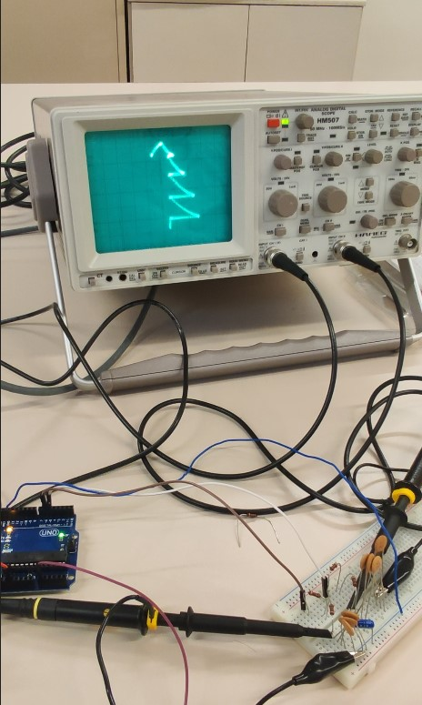

# Arbre_BonNadal
 Arbol y mensaje de Navidad en osciloscopio

Autor: Jordi Rodriguez & Llorenç Marin  
Practica de representacion de señales de Arduino en Osciloscopio  
Arbol de Navidad y mensaje de Feliz Navidad
  
  
  
*** Material utilizado ***

- Arduino UNO R.3
- Potenciometro 
- Osciloscopio
  

*** Pines de conexion ***
  
D5-= Coordenada Y de Osciloscopio  
D6-= Coordenada X de Osciloscopio 
